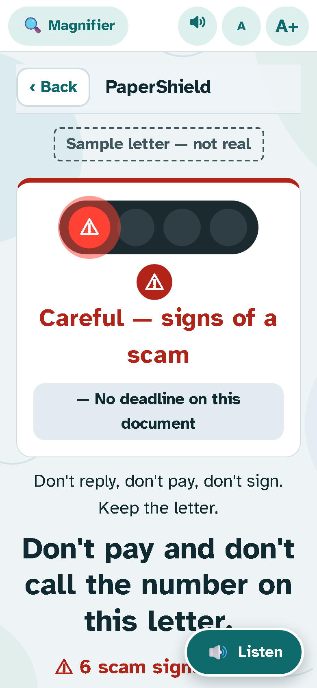
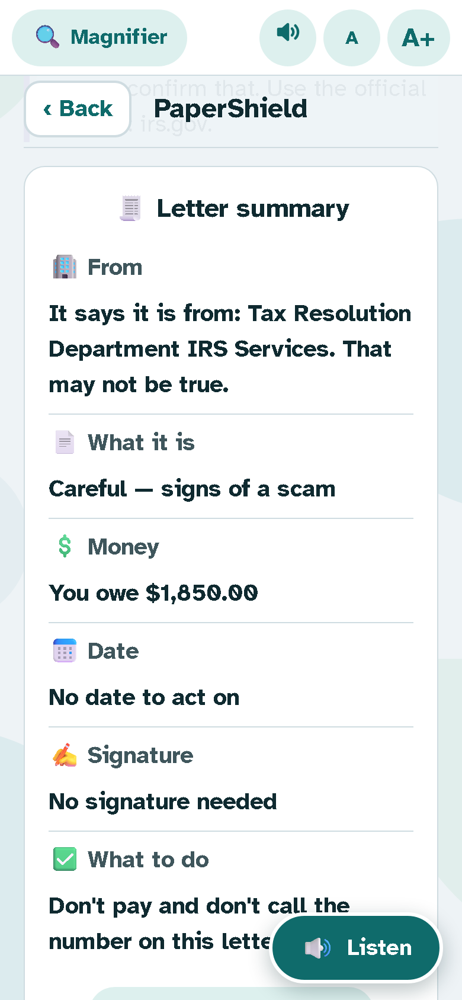
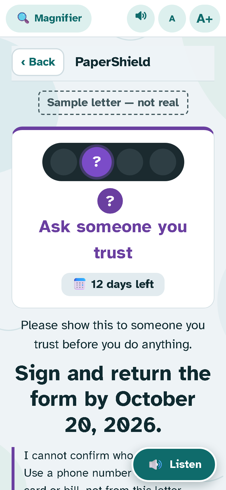
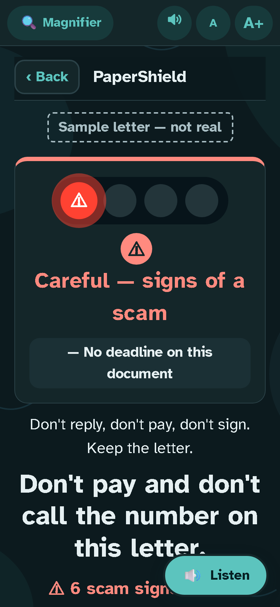
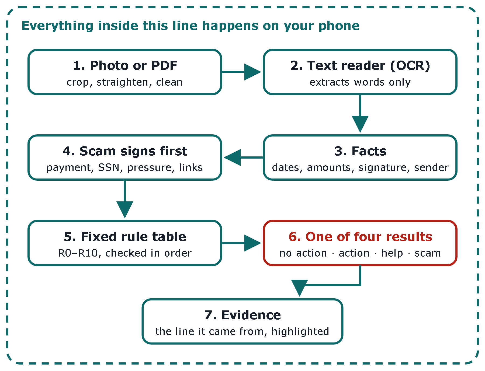

# PaperShield

**Photograph a letter. Get one clear answer: what to do, and by when.**
Everything runs on the phone. No account, no upload, no AI deciding.

**Live app:** https://mai-hakim.github.io/papershield/ · **Landing page:** https://mai-hakim.github.io/papershield/welcome.html
**Demo video (85 s, all letters are fictional samples):** [docs/demo/papershield-demo.webm](docs/demo/papershield-demo.webm)

| Scam caught | Letter summary | Ask someone you trust | Dark mode |
|---|---|---|---|
|  |  |  |  |

## The problem
Bills, insurance notices, government forms and scams arrive in the same mailbox and all look official.
Many older adults, and people with low vision or tremor, have to guess which ones matter. Scammers count on that.

## The solution
PaperShield reads the letter **on the phone** and gives one of four answers. Each answer is a colour **plus** an icon **plus** a word, never colour alone, with a different vibration for each:

| Light | Sign | Answer |
|---|---|---|
| Green | ✓ | No action needed |
| Orange | ! | Action needed (with days left) |
| Purple | ? | Ask someone you trust, with a **Send to someone I trust** button (ready SMS / WhatsApp text that the person reads before sending) |
| Red | ⚠ | Careful: signs of a scam. The lamp pulses slowly, once every 2 seconds, 3 times, then stays on. It never flashes fast. |

Then it shows:
- **Letter summary**: 🏢 who sent it · 📄 what it is · 💲 money · 📅 date · ✍️ signature · ✅ what to do, with its own 🔊 button.
- **📄 See the letter**: the full photo. The 🔍 magnifier works on it.
- **Why I decided this** and **Show me where it says this**: the exact lines on the letter.
- **🤔 I don't understand**: every press tries a different way. 1: simpler words with emoji. 2: read slowly. 3: the line on the letter. 4: ask someone, with a send button.
- **Delete the letter** (default) or **Save on my phone only**: "Saved on your phone only. Never sent to anyone."

Always on every screen: 🔍 **Magnifier** (a lens you drag with your finger, 2.5×), **A / A+** text size, a **mute** button (stops all automatic reading), and a **🔊 Listen** button that reads the screen (tap again to stop). The reading speed is a slider from 🐢 to 🐇 with 5 steps. Moving it plays a sample. The default is slower than before.

## Architecture

## Tools (all free)
- Plain HTML, CSS and JavaScript. A Progressive Web App (works offline after the first visit, can be added to the home screen).
- [Tesseract.js](https://github.com/naptha/tesseract.js) text reader (OCR), pdf.js, jsQR, the Atkinson Hyperlegible font. All are stored in `vendor/`, so there are no outside servers. See `THIRD_PARTY.md`.
- Hosting: GitHub Pages. Testing: Playwright + axe-core (in the `app-tests` scripts used to produce the results below).

## The rules (fixed, published, same letter → same answer)
All decision logic is in [`js/rules.js`](js/rules.js). The table is checked in order; scam signs come first:

| Rule | When | Answer |
|---|---|---|
| R0 | Not enough readable words | I can't read this |
| R1 | Any strong scam sign (gift cards / wire / crypto, asks for SSN, unofficial link) | Scam |
| R2 | Two or more scam signs | Scam |
| R3 | Exactly one scam sign | Ask someone you trust |
| R4 | A signature is required | Ask someone you trust |
| R5 | Money owed and the deadline has passed | Ask someone you trust |
| R6 | Money owed and the date cannot be read for sure | Ask someone you trust |
| R7 | Money owed | Action needed |
| R8 | A deadline | Action needed |
| R9 | An amount, but unclear who pays | Ask someone you trust |
| R10 | None of the above | No action needed |

The app also shows this table under **How it decides**.

## Error handling
- Blurry or dark photo: the camera tells the person to move closer or add light. If the text still can't be read, the answer is **"I can't read this"** with fixes, never a guess.
- Key facts uncertain (date unreadable, two different amounts): the answer becomes **"I'm not sure"** and asks the person to check with someone.
- **"Who sent this?"**: the app looks for a company or office name at the top of the letter. It skips labels, dates, greetings and the reader's own name. If nothing looks like an organisation it says **"I'm not sure who sent this"** and shows the top of the letter. For a scam it says **"It says it is from … That may not be true."**
- No voice on the phone: a message says so; everything is also on screen.

## Human in control
PaperShield never pays, signs, calls or replies. It only advises. Sending to a trusted person always shows the exact message first, and the person presses send in their own SMS or WhatsApp app. Private numbers (SSN, account, card) are masked.

## Privacy
Photos exist only in memory while the result is open. They are wiped when it closes, unless the person presses **Save on my phone only** (stored in this browser's IndexedDB on that phone; each saved letter can be deleted). No analytics, cookies or tracking. A strict Content Security Policy blocks every outside script and connection. See [privacy.html](privacy.html).

## Test cases and results (real runs, October 8, 2026)
Automated checks in Chromium at phone size 390×844, light and dark mode, using Playwright + axe-core: **59 passed, 0 failed.** The details are in [docs/test-results/app-checks.json](docs/test-results/app-checks.json). They include:
- The 5 sample letters give the same answers as before the redesign: bill = Action needed, insurance = No action, benefits form = Ask someone, scam = Scam, refund = No action.
- The 4 stage-1 bugs are fixed and re-tested: (1) the answer word has its own colour, not always green; (2) no sideways scroll at the biggest text; (3) the header title is centred (0 px off); (4) the bottom camera bar and the Listen button stay on screen, also with the invert and dim filters.
- axe-core WCAG 2 A/AA: 0 violations, including 0 colour-contrast problems, on 13 page states (home and 3 results in light and dark, plus 5 info pages).
- **Four fixes came from the AI test agents in Project A** (each confirmed by a fixed check before I fixed it):
  1. **A crash**: tapping the big "Scan a document" button crashed the camera screen ("pages.map is not a function"). This bug was already in the original app.
  2. The sample-letter buttons were too close together for a shaky tap. They now have more space and are taller.
  3. The "Skip to content" link stayed 1×1 px even with keyboard focus. Now it is visible.
  4. The 🔊 "Read aloud" buttons gave no visible feedback. Now they show "Stop" while reading, or a message if the phone cannot read aloud.
- Reduce motion: no pulse and no rise animation. Offline: the app and 4 info pages open with no internet (37 files cached). The same 59 checks also passed on the live site (https://mai-hakim.github.io/papershield/). No console errors.

On-device text reader on the 5 synthetic test photos in `test-set/` (run through `test.html`): **5 of 5 correct answers**, 0 missed scams, 0 false alarms, the blurry photo correctly answered "I can't read this". One field mismatch: on `03_two_amounts.jpg` the answer sheet expects no single amount, but the app read $40.00 (it still answered "Ask someone" with "not sure"). See [docs/test-results/pilot-results.txt](docs/test-results/pilot-results.txt).

## Limits (honest)
- 5 sample letters and 5 synthetic photos are a tiny test. They are not proof. **No real users have tested it yet.**
- Not tested yet: VoiceOver, TalkBack, a real phone (vibration, camera, voices), and older adults using it.
- Spanish text still needs a native speaker's review.
- US letters only (dates, $ amounts, US agencies).

## What I would do in production
- Usability sessions with older adults and caregivers; screen-reader testing on real iPhone and Android phones.
- A larger, labelled test set of real (redacted) letters with measured accuracy per field.
- Legal review of the privacy policy and of the wording "It decides".
- Optional AI letter summary only with explicit consent (prototype: Project B, PaperShield workflow on n8n).

## My role
I (Mai Hakim) designed PaperShield and made every decision: what it does, the four answers, the look, and the accessibility choices. I also tested it. **Claude (an AI assistant) wrote the code.**
Inspired by a capstone idea; this is my own independent build.

---
PaperShield gives information, not financial or legal advice. Sample letters, names, companies and numbers are fictional.
